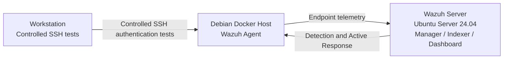
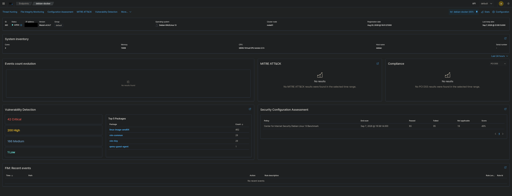
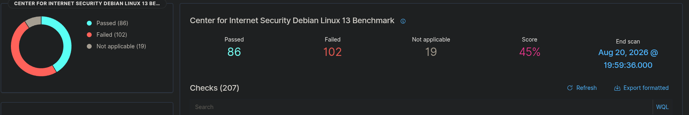
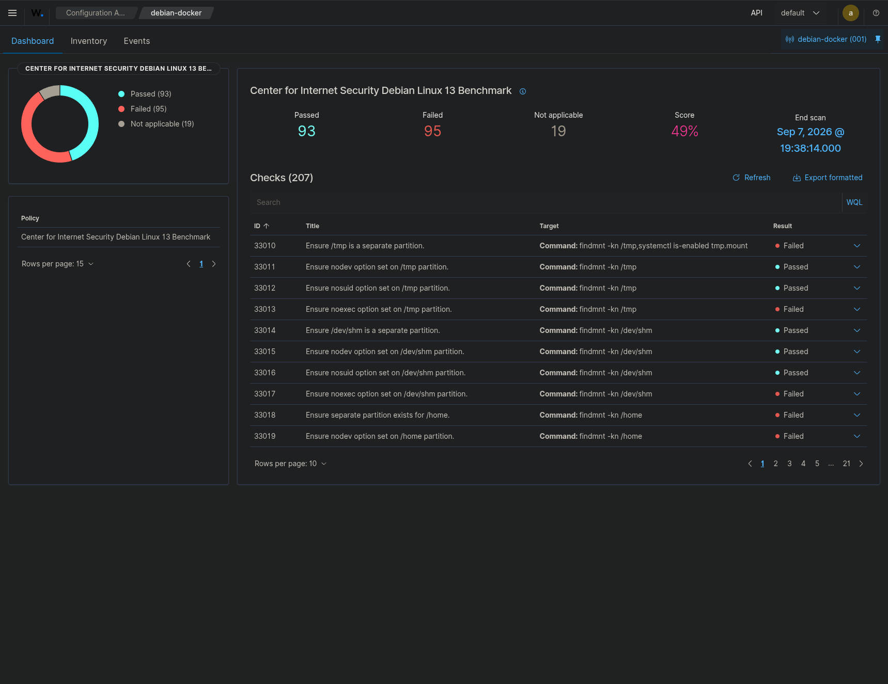
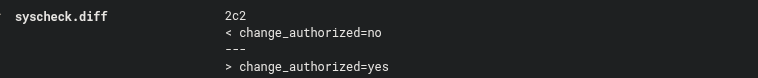
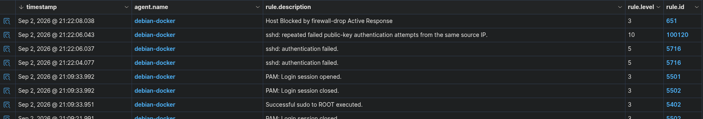

# Homelab SIEM: Wazuh Endpoint Security Project

I built this project to demonstrate a complete blue-team workflow with Wazuh on a real Debian homelab endpoint. Rather than stopping at deployment, I used the SIEM to establish a baseline, investigate vulnerability findings, harden SSH, validate a Security Configuration Assessment false positive, configure File Integrity Monitoring, investigate controlled SSH failures, create a custom correlation rule, and verify Wazuh Active Response.

## What this project demonstrates

- Wazuh manager deployment and Linux agent onboarding
- Vulnerability investigation and remediation decision-making
- CIS-based Security Configuration Assessment
- SSH hardening and effective-configuration verification
- Manual false-positive validation
- Linux account and SSH-access review
- Real-time File Integrity Monitoring
- SSH authentication-event triage
- Custom repeated-event correlation
- MITRE ATT&CK mapping
- Wazuh `firewall-drop` Active Response
- Evidence collection and technical documentation

## Lab architecture

The public documentation intentionally omits numerical internal IP addresses.

## Key results

| Area | Result |
|---|---|
| Wazuh endpoint onboarding | Confirmed |
| Initial SCA baseline | 45% — 86 passed / 102 failed / 19 N/A |
| Final SCA state | 49% — 93 passed / 95 failed / 19 N/A |
| SSH MAC hardening | SCA 33168 passed |
| SSH forwarding hardening | SCA 33161 passed |
| SCA 33300 | Remained failed in Wazuh; manually validated as compliant for the tested condition |
| Legacy `hermes` account | Still present; documented as deferred cleanup |
| FIM modification detection | Confirmed |
| FIM restoration detection | Confirmed |
| SSH authentication detection | Rule 5716 confirmed |
| Custom SSH correlation | Rule 100120, level 10, frequency 3 |
| Active Response | Wazuh recorded `Host Blocked by firewall-drop Active Response` |
| SSH restoration | Successfully reconnected after the temporary response window |

## Evidence highlights

### Final endpoint overview

### SCA improvement

### File Integrity Monitoring

### SSH correlation and Active Response

## Documentation

- [Full project documentation](docs/PROJECT_DOCUMENTATION.md)
- [Evidence index](docs/EVIDENCE_INDEX.md)

## Scope and limitations

This was a single-endpoint homelab project, not an enterprise SOC deployment. The selected kernel CVEs remained monitoring items rather than being claimed as fully remediated. FIM who-data was not enabled for the dedicated demonstration path. The `hermes` account remains a documented cleanup item. The SSH attack sequence was controlled testing, not a real intrusion.

## Project status

The technical workflow is complete and documented. The remaining `hermes` account cleanup is intentionally tracked as an unresolved access-management finding rather than being presented as completed remediation.
