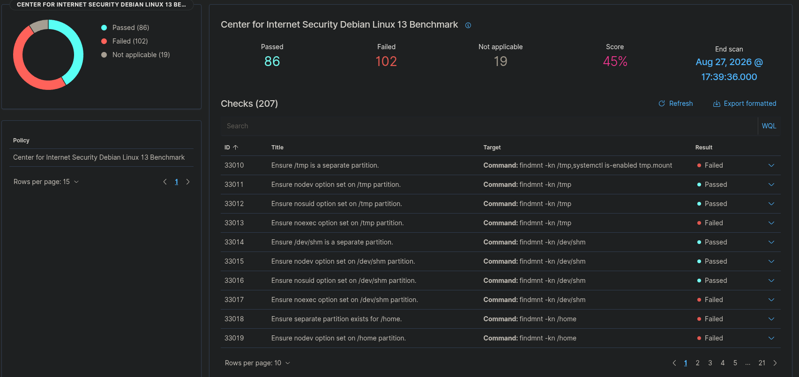

# 3. Phase 1 — Baseline

## Objective

Before changing the endpoint, I verified that the Wazuh manager and Debian agent were healthy and communicating. I also recorded the endpoint operating-system, kernel, agent, SCA, and vulnerability state so that later changes had a comparison point.

I used:

```bash
cat /etc/os-release
uname -r
dpkg-query -W -f='${Package} ${Version}\n' wazuh-agent
sudo systemctl is-active wazuh-agent
```

The retained results showed:

```text
Debian GNU/Linux 13 (trixie)
Debian version 13.6
Kernel: 6.12.101+deb13-amd64
wazuh-agent: 4.14.7-1
wazuh-agent service: active
```

The endpoint contained the Wazuh SCA policy at:

```text
/var/ossec/ruleset/sca/cis_debian13.yml
```

## Initial SCA state

My initial SCA baseline was:

| Metric | Result |
|---|---:|
| Score | 45% |
| Passed | 86 |
| Failed | 102 |
| Not applicable | 19 |
| Total checks | 207 |


The detailed control list is also retained:



## Initial vulnerability state

My early project notes recorded:

- 52 Critical
- 231 High
- 310 Medium
- 2 Low
- 629 Pending

I treated these values as an investigation baseline, not as proof that every item was an immediately exploitable security weakness.

### Phase 1 result

I established a working SIEM/agent communication path and a measurable security baseline before performing remediation.

---
