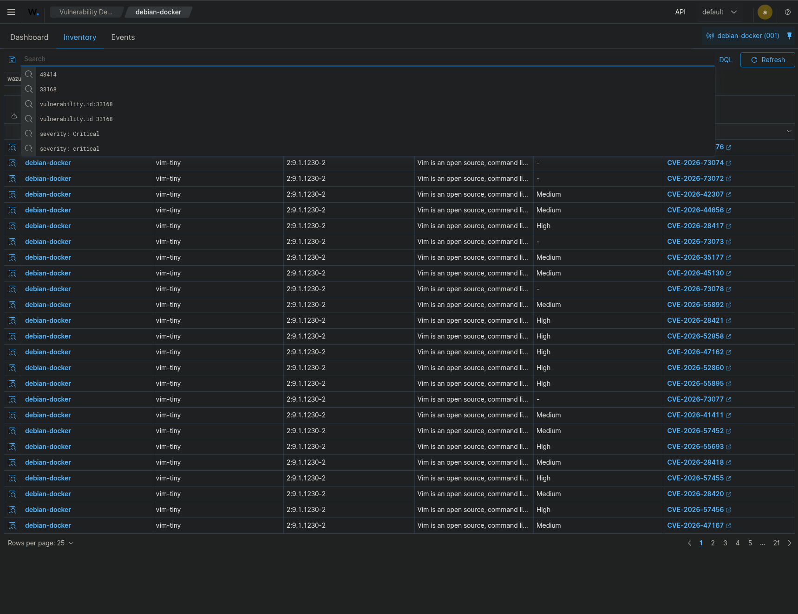
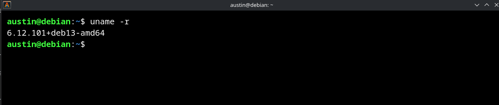
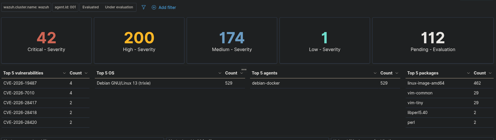
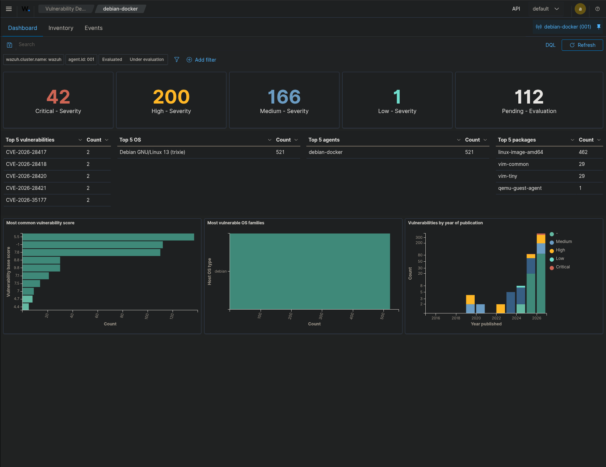

# 4. Phase 2 — Vulnerability Management

## Objective

The roadmap initially called for investigating one meaningful CVE. I expanded that step to three related Linux kernel findings so I could compare Wazuh inventory data with the running endpoint state.

## Selected findings

| CVE | Package reported by Wazuh | Recorded installed version | Fixed version in retained project record |
|---|---|---|---|
| CVE-2026-43414 | `linux-image-6.12.94+deb13-amd64` | `6.12.94-1` | Unavailable / undetermined |
| CVE-2026-53246 | `linux-image-6.12.94+deb13-amd64` | `6.12.94-1` | Unavailable / undetermined |
| CVE-2026-43083 | `linux-image-6.12.94+deb13-amd64` | `6.12.94-1` | Unavailable / undetermined |

The final documentation screenshot is a general vulnerability inventory view rather than a preserved detail page for one of those three CVEs:



## Investigation

I checked the running kernel instead of treating the Wazuh package finding as a complete statement about runtime state.



The endpoint was running:

```text
6.12.101+deb13-amd64
```

That was newer than the originally reported `6.12.94` kernel. However, I did not have a retained vendor-provided fixed version for the selected CVEs, so I did not claim that a newer running kernel alone proved those findings were fully remediated.

## Troubleshooting: CVEs remained in Wazuh

The selected CVEs continued to appear in Wazuh after kernel/package maintenance. I therefore compared:

- Wazuh vulnerability inventory,
- installed package information,
- running kernel state,
- and the availability of a documented fixed version.

I retained the findings for monitoring rather than suppressing them to create a cleaner dashboard.

## Package-cleanup decision

During package maintenance, `apt autoremove --dry-run` identified:

```text
slirp4netns
libslirp0
```

as removable. I did not remove them because the endpoint is a Docker host and I had not yet verified whether they were involved in container/rootless networking. This was a deliberate change-management decision: package-manager cleanup suggestions were not treated as automatically safe.

## Final vulnerability dashboard state

An intermediate capture showed:



The final retained dashboard showed:

- 42 Critical
- 200 High
- 166 Medium
- 1 Low
- 112 Pending



I do not attribute the full change in dashboard counts solely to the three selected CVE investigations. The counts reflect the overall Wazuh vulnerability state at different points in the project.

### Phase 2 result

I used Wazuh as the starting point for vulnerability investigation, but I based the remediation decision on the combined package, runtime, and fix-availability evidence. The selected kernel findings remained monitoring items rather than being incorrectly documented as fully cleared.

---
