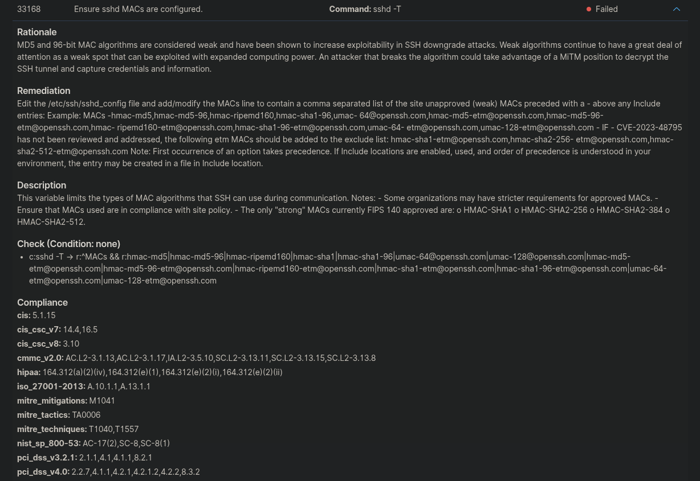
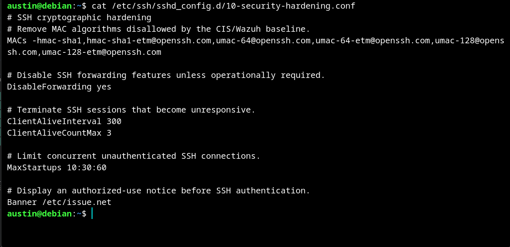
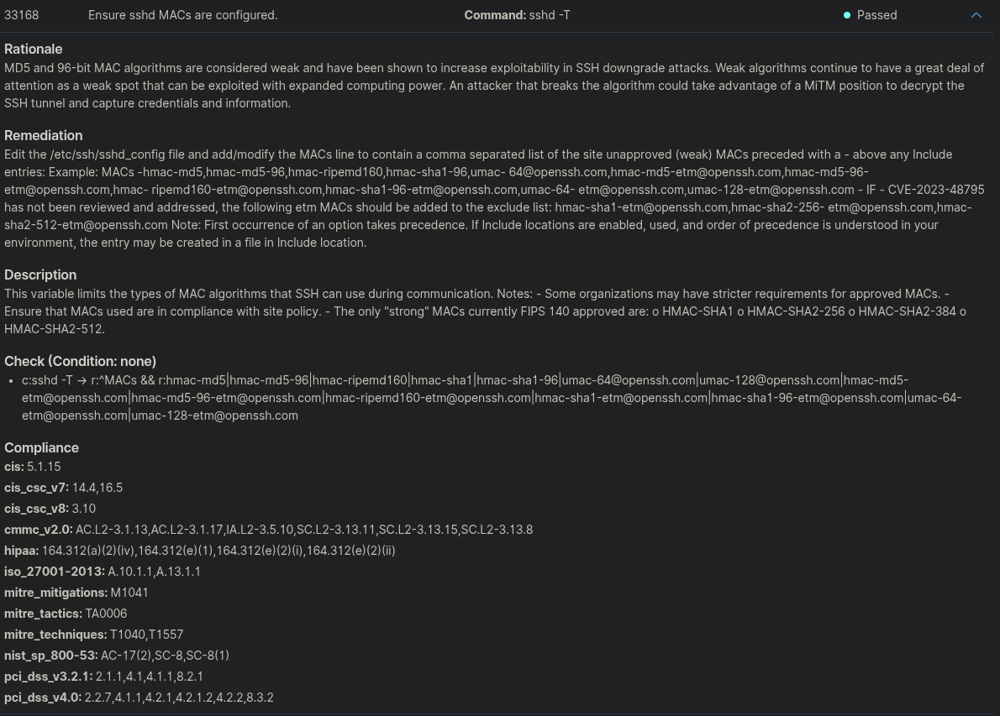
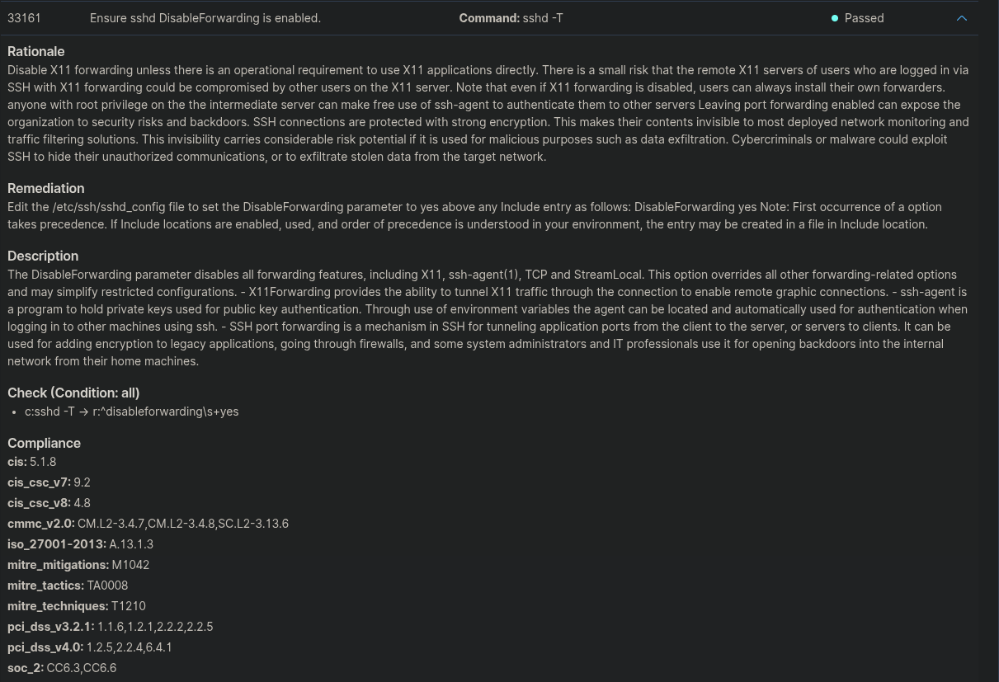
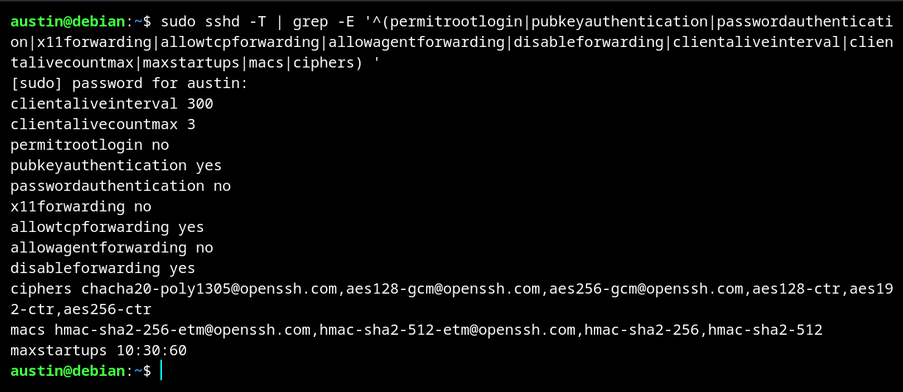
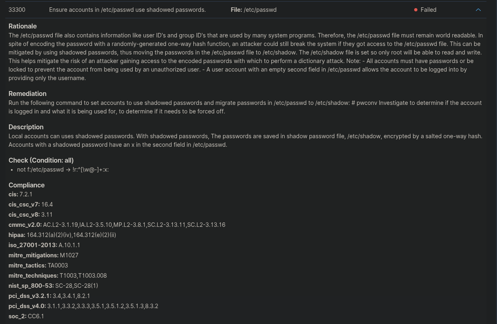
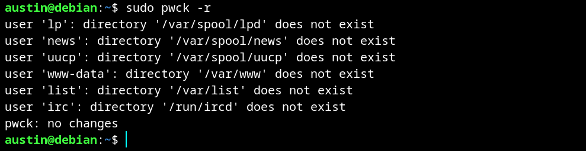
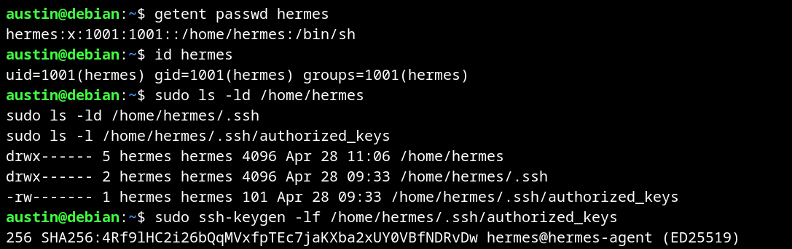

# 5. Phase 3 — Security Hardening

## Objective

I reviewed SCA findings and focused on three controls:

- `33168` — SSH MAC algorithm hardening
- `33161` — SSH forwarding hardening
- `33300` — shadowed password validation

The phase intentionally included both remediation and manual validation.

## 5.1 SCA 33168 — SSH MAC algorithms

Before remediation, Wazuh reported the control as failed:



I used a dedicated SSH hardening file:

```text
/etc/ssh/sshd_config.d/10-security-hardening.conf
```

Relevant settings included:

```text
MACs hmac-sha2-256-etm@openssh.com,hmac-sha2-512-etm@openssh.com,hmac-sha2-256,hmac-sha2-512
DisableForwarding yes
X11Forwarding no
ClientAliveInterval 300
ClientAliveCountMax 3
MaxStartups 10:30:60
Ciphers chacha20-poly1305@openssh.com,aes128-gcm@openssh.com,aes256-gcm@openssh.com,aes128-ctr,aes192-ctr,aes256-ctr
```



After remediation, control `33168` passed:



## 5.2 SCA 33161 — SSH forwarding

I enabled:

```text
DisableForwarding yes
```

Wazuh then reported SCA `33161` as passed:



## Effective SSH verification

I verified the daemon's effective configuration with `sshd -T` rather than relying only on the configuration file.

The filtered output confirmed:

```text
clientaliveinterval 300
clientalivecountmax 3
permitrootlogin no
pubkeyauthentication yes
passwordauthentication no
x11forwarding no
allowtcpforwarding yes
allowagentforwarding no
disableforwarding yes
maxstartups 10:30:60
```

It also showed the intended cipher and SHA-2 MAC lists.



`allowtcpforwarding yes` and `disableforwarding yes` can appear together in the effective output. The SCA control specifically validates `DisableForwarding yes`, which disables forwarding features globally.

## 5.3 SCA 33300 — manual validation

Wazuh continued to report SCA `33300` as failed:



The control concerns accounts in `/etc/passwd` using shadowed passwords. I manually checked the second field of `/etc/passwd`:

```bash
sudo awk -F: '$2 != "x" {print $1 ": password-field=" $2}' /etc/passwd
```

The command returned no entries in my retained test output.

I then ran:

```bash
sudo pwck -r
```

`pwck` reported missing directories for several service accounts, including `lp`, `news`, `uucp`, `www-data`, `list`, and `irc`, but ended with:

```text
pwck: no changes
```



The manual `/etc/passwd` check did not reproduce the condition reported by Wazuh. I therefore treated SCA `33300` as a disputed scanner result for this endpoint and did not modify the endpoint or Wazuh policy simply to improve the score.

## Additional finding: legacy `hermes` account

While reviewing accounts, I found a legacy `hermes` account with:

- an interactive shell,
- `/home/hermes`,
- `/home/hermes/.ssh`,
- and an `authorized_keys` file.

The associated system had been decommissioned. I rechecked the account during final evidence collection and confirmed that it is still present.



I documented this as deferred access cleanup rather than claiming remediation that had not occurred.

## Final SCA state

| Metric | Initial | Final |
|---|---:|---:|
| Score | 45% | 49% |
| Passed | 86 | 93 |
| Failed | 102 | 95 |
| Not applicable | 19 | 19 |
| Total checks | 207 | 207 |


The overall scan gained seven passing controls. I do not attribute all seven changes exclusively to the three controls discussed above.

### Phase 3 result

I demonstrated two different security outcomes:

1. I remediated SSH controls and verified the effective daemon configuration.
2. I manually validated a failed SCA finding that did not match the endpoint condition I tested, avoiding an unnecessary configuration change.

The account review also identified an unresolved SSH-access cleanup item.

---
