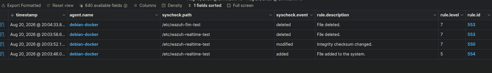
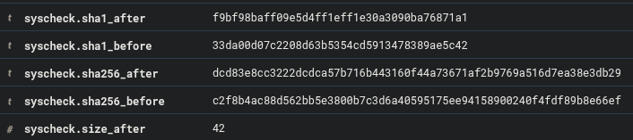
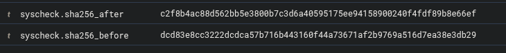

# 6. Phase 4 — File Integrity Monitoring

## Objective

I configured a controlled FIM scenario to verify that Wazuh could detect a file modification, capture the exact content change, and detect the restoration.

## Configuration

Real-time monitoring of `/etc` had already been tested earlier in the project:



For the controlled demonstration, I created:

```text
/var/local/wazuh-fim-demo/baseline.txt
```

and monitored the directory with:

```xml
<directories check_all="yes" realtime="yes" report_changes="yes">/var/local/wazuh-fim-demo</directories>
```

The baseline file contained:

```text
system_status=secure
change_authorized=no
```

## Controlled modification

I changed:

```text
change_authorized=no
```

to:

```text
change_authorized=yes
```

Wazuh generated a modification event and recorded the changed integrity attributes:

```text
size, mtime, md5, sha1, sha256
```




Because `report_changes="yes"` was enabled, Wazuh also recorded the exact line-level change:


The SHA-256 transition for the modification was:

```text
Before: c2f8b4ac88d562bb5e3800b7c3d6a40595175ee94158900240f4fdf89b8e66ef
After:  dcd83e8cc3222dcdca57b716b443160f44a73671af2b9769a516d7ea38e3db29
```


## Restoration

I restored the file from:

```text
change_authorized=yes
```

back to:

```text
change_authorized=no
```

Wazuh captured the reverse content diff:


The restoration hash transition was:

```text
Before: dcd83e8cc3222dcdca57b716b443160f44a73671af2b9769a516d7ea38e3db29
After:  c2f8b4ac88d562bb5e3800b7c3d6a40595175ee94158900240f4fdf89b8e66ef
```



This returned the file to the original baseline hash.

## Limitation

I did not enable `whodata` for the dedicated demonstration path. The evidence therefore proves:

- which file changed,
- what content changed,
- and how the integrity values changed,

but I do not claim process/user attribution for this test.

### Phase 4 result

Wazuh detected both the controlled modification and the restoration in real time, including integrity metadata and line-level content changes.

---
