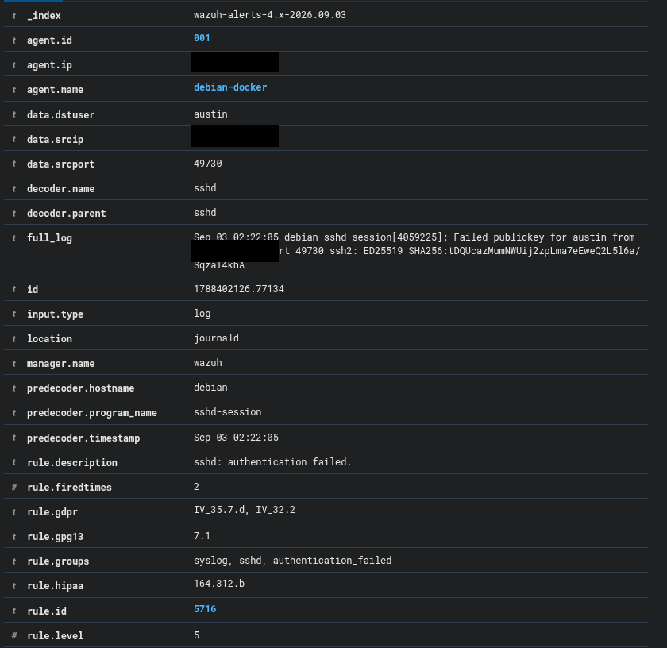
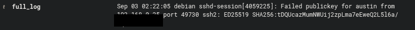

# 7. Phase 5 — Controlled SSH Security Event

## Objective

I generated controlled failed SSH authentication attempts from a separate workstation and investigated the resulting Wazuh alert.

The Debian endpoint already used public-key authentication with password authentication disabled, so I tested failed public-key authentication rather than weakening the endpoint for a password-based demonstration.

## Rule 5716

Wazuh generated:

```text
Rule ID: 5716
Description: sshd: authentication failed.
Level: 5
Authentication event: Failed publickey
```

The event identified:

- the monitored `debian-docker` agent,
- the workstation as the source,
- `austin` as the target account,
- the SSH decoder,
- and the raw failed-public-key log.

The numerical addresses are redacted in the public screenshot.



A focused sanitized log excerpt is retained separately:



## Investigation workflow

I confirmed:

1. the Wazuh rule that fired,
2. the monitored endpoint,
3. the source of the event,
4. the targeted user,
5. the authentication method,
6. and the corresponding raw log.

### Phase 5 result

I demonstrated basic authentication-event triage using Wazuh and confirmed that the endpoint's failed public-key events were being collected and decoded correctly.

---
