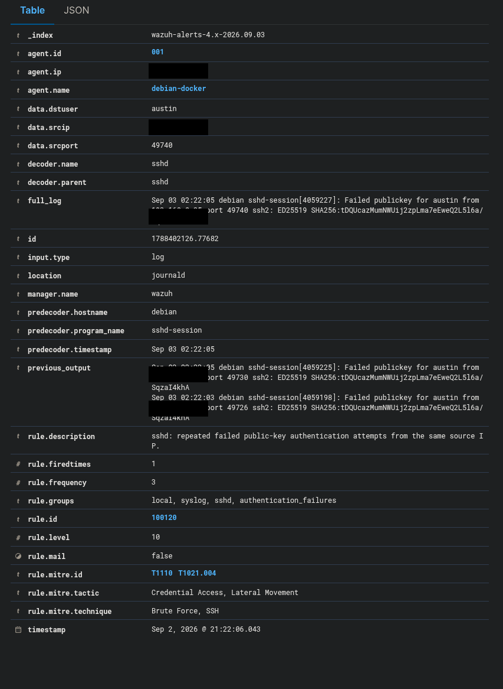

# 8. Phase 6 — Custom Detection and Active Response

## Objective

I extended the SSH scenario from individual authentication alerts to repeated-event correlation and temporary automated containment.

## Built-in rule review

Before writing a custom rule, I reviewed Wazuh's existing SSH rules. The built-in path I investigated did not produce the desired correlation/response behavior for the public-key failure scenario generated by this hardened endpoint.

Instead of re-enabling password authentication to fit a different detection example, I kept the endpoint's stronger authentication configuration and adapted the detection logic to the telemetry it actually produced.

## Custom rule 100120

My final custom detection behavior was:

```text
Rule ID: 100120
Level: 10
Base event: rule 5716
Authentication event: Failed publickey
Correlation: same source
Frequency: 3
Timeframe: 120 seconds
```

I mapped the event to:

```text
T1110 — Brute Force
T1021.004 — Remote Services: SSH
```

The retained Wazuh event confirms rule `100120`, level `10`, frequency `3`, and the MITRE mappings:



The event list also shows the correlated rule following rule `5716` authentication failures:


I did not retain a clean copy of the final `local_rules.xml` block, so I do not publish reconstructed XML. The rule behavior above is documented from the project record, while the dashboard evidence confirms the resulting custom alert.

## Active Response

The custom rule was connected to Wazuh's `firewall-drop` Active Response. The response was configured as a temporary block with a 60-second timeout.

During the controlled test, Wazuh recorded:

```text
Host Blocked by firewall-drop Active Response
Rule ID: 651
```

immediately after the custom rule `100120` event.


This is direct evidence that the Wazuh response path executed after the correlated SSH event.

## Connectivity restoration

After the temporary response window, I tested SSH from the workstation again and normal access returned. I did not retain a separate Wazuh unblock-event screenshot, so I document the restored connectivity as an observed test result rather than claiming a preserved dashboard artifact for the unblock action.

### Phase 6 result

The completed workflow was:

```text
Failed public-key authentication
→ Wazuh rule 5716
→ repeated failures from the same source
→ custom rule 100120
→ Wazuh firewall-drop Active Response
→ temporary SSH source block
→ SSH connectivity restored after the response window
```

This phase demonstrated detection engineering and automated response rather than stopping at a single alert.

---
